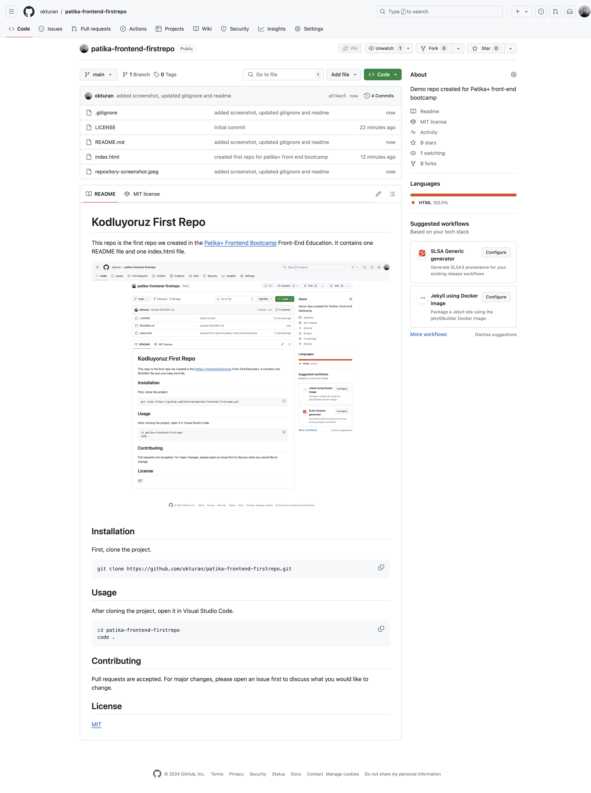

# Patika+ Frontend First Repository

> **Status:** historical first-repository exercise from the Patika+ Frontend Bootcamp. It is retained as a visible learning milestone, not presented as a maintained website.

This exercise introduced repository creation, cloning, a minimal HTML document, Markdown documentation, and adding an image asset to a README.



## View locally

No dependencies or build step are required:

```bash
git clone https://github.com/okturan/patika-frontend-firstrepo.git
cd patika-frontend-firstrepo
open index.html
```

## Evidence boundary

The screenshot documents the GitHub repository page created during the exercise; it is not a product UI screenshot. The repository intentionally has no hosted demo, CI workflow, package, or release history. Later frontend repositories provide stronger implementation, visual, accessibility, testing, and deployment evidence.

## License

[MIT](LICENSE)
